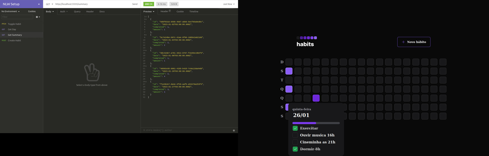

# HABITS 

O pojeto HABITS serve para que o usuário cadastre seus hábitos e comece a monitorá-los.

Author: Dev Meditation

## HABITS API

Essa é a API (backend) do projeto Habits, ela serve para armazenar os dados do usuário e fornece-los para os clients [web](https://github.com/devmeditation/habits-web) e [mobile](https://github.com/devmeditation/habits-mobile) os quais interagem diretamente com os usuários.

### TECHS | LIBS

- [NodeJS](https://nodejs.org/en/)
- [TypeScript](https://www.typescriptlang.org/)
- [Fastify](https://www.fastify.io/)
- [Prisma IO](https://www.prisma.io/)
- [SQlite](https://www.sqlite.org/)
- [DayJS](https://day.js.org/)
- [Zod Dev](https://zod.dev/)
- [CORS](https://developer.mozilla.org/pt-BR/docs/Web/HTTP/CORS)
- [@types/node](https://www.npmjs.com/package/@types/node)
- [tsx](https://www.npmjs.com/package/tsx)
- [Web-Push](https://www.npmjs.com/package/web-push)
- [PushManager](https://developer.mozilla.org/pt-BR/docs/Web/API/PushManager)

## CONTATO

- [BCL-LAB](https://youtube.com/@bcllab)

