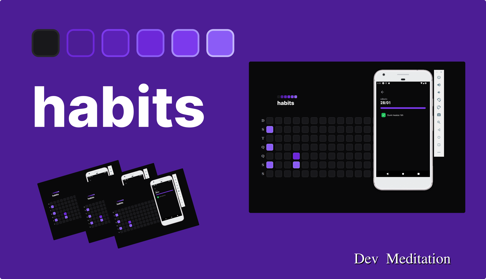

# Habits

## iniciando projeto do zero

- Criar uma pasta e dentro dela inicializar o projeto

```
mkdir backend 

cd backend 

npm init -y 
```

- Instalando o Fastfy
```
npm i fastify 
```

- Instalando e configurando o TypeScript
```
npm i -D  typescript 

npx tsc --init 
```

- Instalando o tsx converter typscript para js e fazer o nodejs entender o código
```
npm i -D tsx 

npx tsx src/server.ts 
```

- Instalando o prisma
```
npm i -D prisma
npm i @prisma/client
```

- Iniciando o prisma e informando qual banco de dados usar "SQLite"
```
npx prisma init --datasource-provider SQLite
npx prisma migrate dev
npx prisma studio
```

- Populando o DB com prisma seed
```
npx prisma db seed
```

- instalando o cors para fastify
```
npm i @fastify/cors
```
